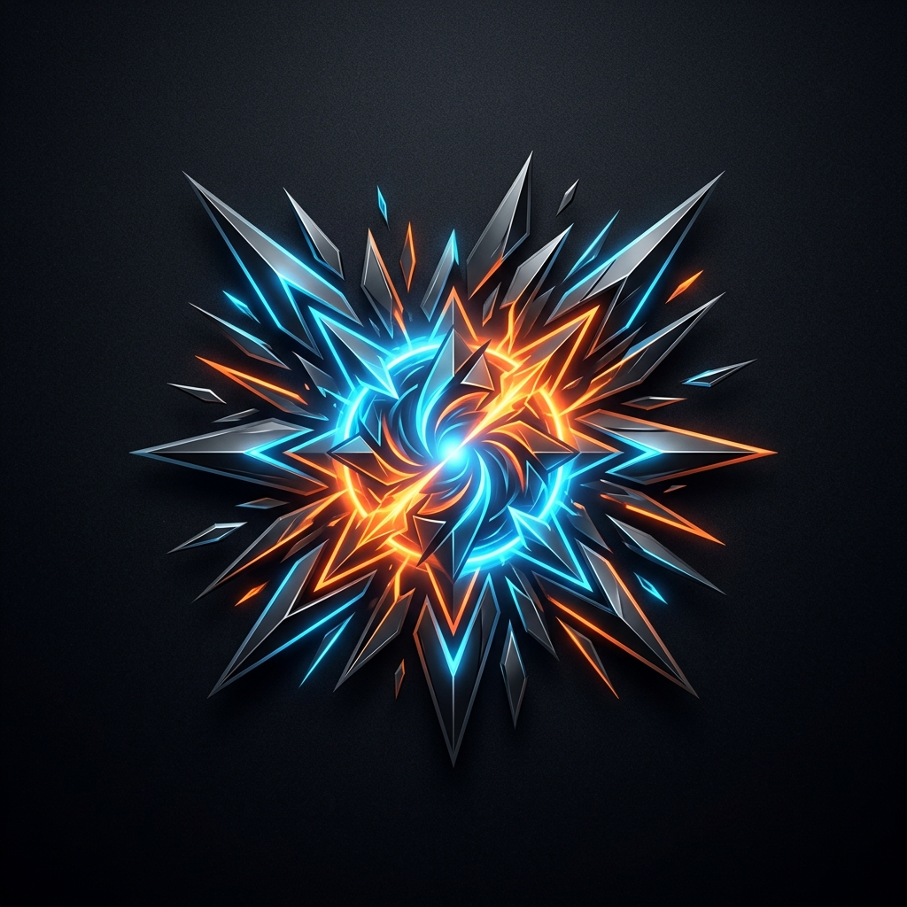
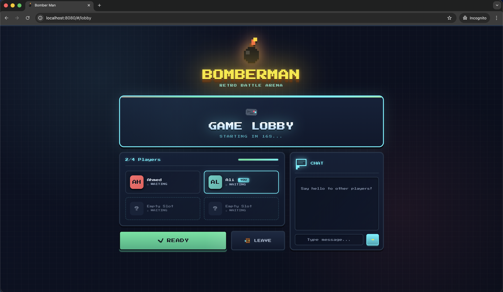
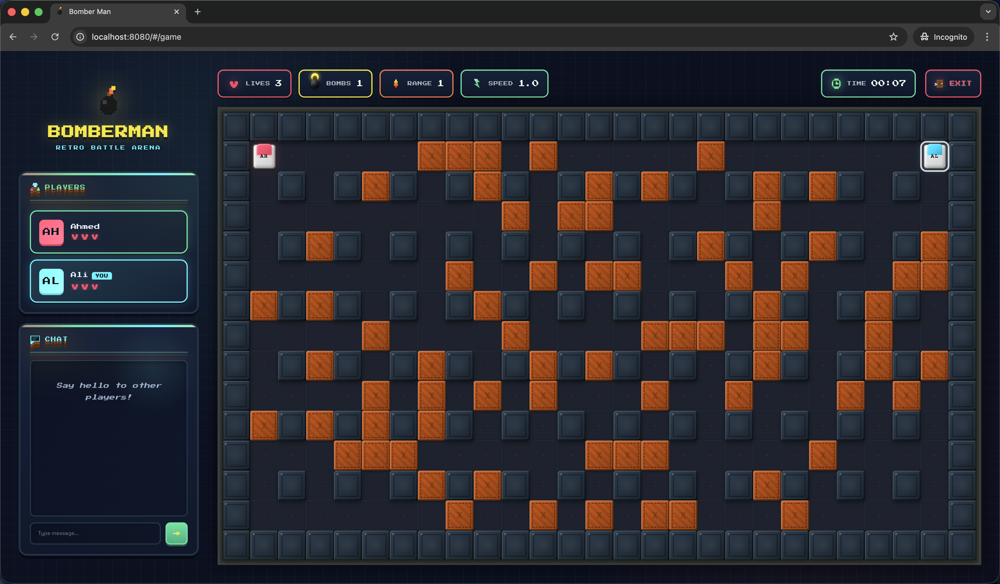
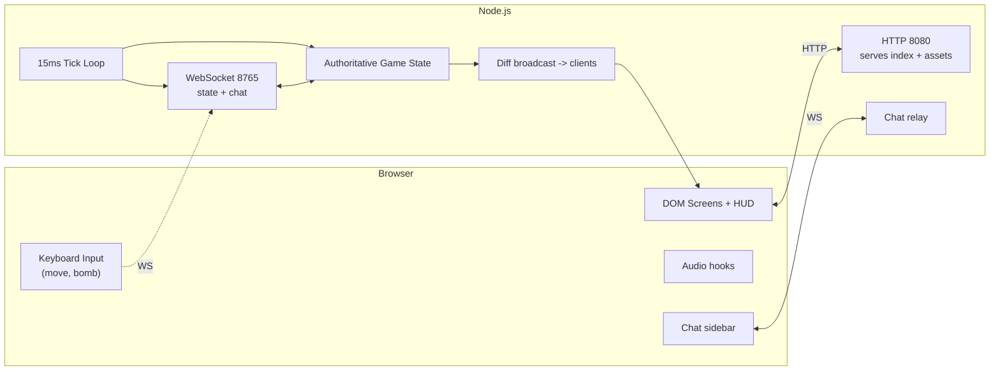
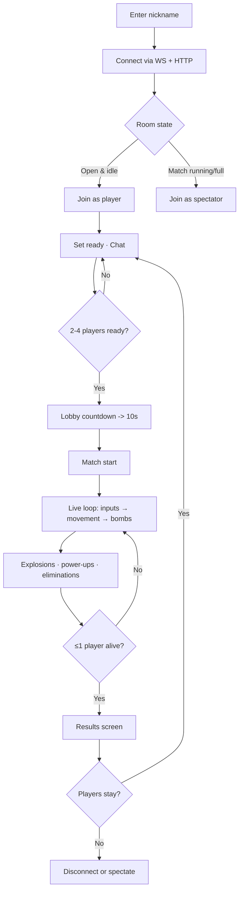
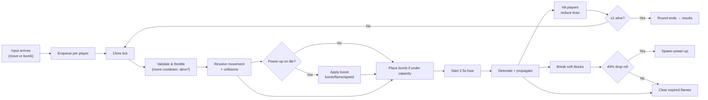

# Bomberman DOM 💣

<p align="center">
	
</p>

<p align="center">
	<a href="#-screenshots">Screenshots</a> •
	<a href="#-highlights">Highlights</a> •
	<a href="#-game-flow">Flow</a> •
	<a href="#-game-logic">Logic</a> •
	<a href="#-power-ups">Power-ups</a> •
	<a href="#-run-it-locally">Run</a> •
	<a href="#-authors">Authors</a>
</p>

<p align="center">
	
</p>

<p align="center">
	
</p>

[](https://nodejs.org/)
[](#-tech-stack)
[](#-tech-stack)
[](#-tech-stack)
[](#-tech-stack)
[](LICENSE.md)
[](#-tech-stack)

<p align="center">
	
	
	
	
</p>

---

Bomberman DOM is a fast multiplayer bomberman arena built with plain JavaScript and CSS. Four players share one lobby, chat while they ready up, and drop bombs on a destructible grid while a Node.js server keeps everyone in sync over WebSocket.

<p align="center">
	
</p>

## ⚡ Fast Facts

- 4-player lobby with ready states, countdown, and chat in one screen.
- 15ms server tick; 2.5s bomb fuse; 0.6s lingering explosions.
- Destructible map (27 x 15 tiles) with corner safety spawns.
- Power-ups: bomb capacity, flame range, and movement speed boosts.
- Spectate running matches and swap into play next round.

## 📋 Table of Contents

- [Highlights](#-highlights)
- [Tech Stack](#-tech-stack)
- [Screenshots](#-screenshots)
- [Architecture](#-architecture)
- [Game Flow](#-game-flow)
- [Game Logic](#-game-logic)
- [Power-ups](#-power-ups)
- [Numbers That Matter](#-numbers-that-matter)
- [Controls](#-controls)
- [Run It Locally](#-run-it-locally)
- [Project Structure](#-project-structure)
- [Authors](#-authors)

---

## ⭐ Highlights

- **Lobby that moves:** Ready toggles, countdowns, and chat; auto-starts with 2-4 players.
- **Spectator friendly:** Watch live rounds if the room is full or mid-game, then rotate in.
- **Tight loop:** 15ms ticks drive movement, bombs, explosions, and clean-up.
- **Destruction with rewards:** Blocks break, drop pickups, and change how each run feels.
- **Quick rematch:** Results screen keeps everyone in the room for instant replay.

## 🧭 Quick Tour

- **Lobby → Countdown → Match → Results → Replay** without reloading the page.
- **Chat stays live** in lobby and in-game sidebar so coordination never stops.
- **HUD overlays** for bombs, flames, and player stats keep info readable mid-chaos.

<p align="center">
	
</p>

## 📸 Screenshots

<div align="center">
	
	<p><em>Lobby with ready states and chat</em></p>
</div>

<div align="center">
	
	<p><em>In-game arena with bombs, flames, and pickups</em></p>
</div>

---

## 🛠 Tech Stack

- **Node.js + ws**: HTTP server plus WebSocket host for live play (`server.js`).
- **Vanilla JS DOM client**: Minimal reactive layer in `framework/`, screens in `app/`.
- **CSS-only styling**: Custom sheets in `app/styles/` with responsive arena sizing.
- **No bundler**: Direct ES module imports in the browser; dependencies kept lean.

## 🏗 Architecture



## 🎮 Game Flow



## 🧠 Game Logic



## ⚡ Power-ups

Power-ups drop when a destructible block is hit by an explosion (40% chance) and stay on the tile until a living player steps on them.

- **Bomb**: +1 bomb capacity (how many live bombs you can place).
- **Flame**: +1 blast range (extra tiles in all four directions).
- **Speed**: +0.5 speed. Move cooldown becomes `max(40ms, floor(150ms / speed))`; default speed is 1 (150ms per move). The next-move timer is reset so the boost is felt right away. Source: `server/gameLogic.js` (`applyPowerUpToPlayer`, `computeMoveIntervalMs`).

## 🔢 Numbers That Matter

- Map: 27 x 15 tiles (`game/state.js`), fixed walls on even coordinates, safe spawn zones in each corner.
- Lives: 3 per player.
- Bomb fuse: 2.5 seconds; explosion linger: 0.6 seconds.
- Bomb range: starts at 1 tile; grows with every flame pickup.
- Bomb capacity: starts at 1; grows with every bomb pickup.
- Tick rate: 15ms server loop for inputs, bombs, and clean-up.

## ⌨️ Controls

- Move: `W A S D` or arrow keys.
- Drop bomb: `Space`.
- Chat: text box in lobby and game sidebar.
- Ready/Unready: lobby button; leave via the lobby action menu.

## 🚀 Run It Locally

Prereqs: Node.js 18+ and npm. Optional: `nvm` to install/use Node quickly.

```bash
nvm install 20
nvm use 20
```

Install dependencies:

```bash
npm install
```

Start everything (HTTP + WebSocket servers):

```bash
./run.sh
# or
npm start    # same as: node server.js
```

Open `http://localhost:8080` in your browser. Keep at least two clients open to trigger the lobby start; extra clients can spectate.

## 📁 Project Structure

- `server.js` — static file server + WebSocket host (ports 8080 / 8765).
- `server/` — lobby, timers, game loop, and power-up logic (`gameLogic.js`, `match.js`).
- `game/` — shared constants, map generation, and entity factories.
- `app/` — DOM screens (`screens/`), icons, audio hooks, and styling.
- `framework/` — minimal reactive/rendering helpers for the client.

## 👥 Authors

- Sayed Ahmed Husain — sayedahmed97.sad@gmail.com
- Qassim Aljaffer
- Salah Yuksel

MIT licensed (see `LICENSE.md`). Have fun bombing.
